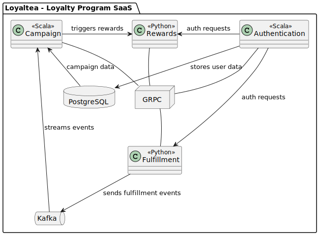

[](https://stand-with-ukraine.pp.ua)

<p align="center">
    
</p>


# loyaltea
Loyaltea - a loyalty program SAAS. Having loyal clients is as easy as drinking cup of tea!
## About
The project consists of a list of dockerized services written in Python and Scala, 
services communicate using Kafka and store their data in PostgreSQL database.
Python services are written with Django framework, Django ORM(psycopg), Django REST Framework and kafka-python.
Scala services are written with zio, distage, zio-kafka, smithy4s, doobie + quill

### Services
The project consists of 4 services:
- **Fulfillment**
  - _Technology_: Python
  - _Functionality_: Listens for various internal events like users buying something or
  doing some activity and decides when user completed some condition 
  that can trigger fulfillment completion.

- **Reward**
  - _Technology_: Python
  - _Functionality_: Manages user rewards like loyalty point or bonus points 
   which can be exchanged for something by tenant and rewards entities that 
   can define the rules for how user gets rewards

- **Campaign**
  - _Technology_: Scala
  - _Functionality_: User can create campaigns with a set of fulfillments and rewards,
  when all fulfillments are completed user gets designated rewards 

- **User**
  - _Technology_: Scala
  - _Functionality_: Handles user authentication, security and management.

### Communication
Apache Kafka is used for service communication for handling event-driven architecture and message streaming.

### Database
Each services uses PostgreSQL for reliable and robust data management.

### General Guidelines
Onion Architecture to maintain a layered, modular structure.
Maintain disciplined source code structure.

### Infrastructure
Docker Compose for now, but can be scaled


### Architecture
<p align="center">
    
</p>

## Run
Build docker images for services:
```bash
docker build -t reward:0.0.1 reward/. 
docker build -t fulfillment:0.0.1 fulfillment/. 
( cd campaign ; sbt docker:publishLocal )
```

Start infrastructure:
```bash
(cd run/loyaltea_infra ; docker compose up)
```

Start services(if some are not need because you run them local disable them):
```bash
(cd run/loyaltea_services ; docker compose up)
```
 
Create django super user
```bash
docker exec $PYTHON_CONTAINER python manage.py createsuperuser
```

Now you have:

Infrastructure
- Postgres http://localhost:5432
- Kafka http://localhost:9092
- Kafka UI http://localhost:8081
- Zookeeper http://localhost:2181
  
Services
- Campaign http://localhost:9001
- Reward http://localhost:9002
- Fulfillment http://localhost:9003
- User http://localhost:9004  


## Testing
To test how everything works firstly create some campaign

- Create Reward http://localhost:9002/rewards/
```json
{
  "tenant": "meiwei",
  "reward_id": "0e41cc11-5e54-448b-a6ce-9c9a855ad207",
  "reward_points": 100.0
}
```
- Create Buy Fulfillment http://localhost:9003/buy-fulfillments/
```json
{
  "url": "http://localhost:9003/buy-fulfillments/1/",
  "tenant": "meiwei",
  "fulfillment_id": "7bed8bf6-995b-450d-8417-1c368709e1e3",
  "name": "Lucky 100 bread",
  "product": "bread",
  "amount": 100.0
}
```
- Create Campaign using created Reward and Fulfillment http://localhost:9001/docs/index.html#/default/Create
```json
{
  "tenant": "meiwei",
  "name": "Lucky Guys Campaign",
  "fulfillments": ["7bed8bf6-995b-450d-8417-1c368709e1e3"],
  "rewards": ["0e41cc11-5e54-448b-a6ce-9c9a855ad207"]
}
```

Now you can send various Kafka message to test the system isolated or try E2E Flow
would be to send event to buy topic and it should go through whole system and give user a reward.  

For our example if we buy bread with amount higher that 100 we should get loyalty points on our balance.

You can produce message here http://localhost:8081/ui/clusters/local/all-topics/buy
```json
{
  "tenant": "meiwei",
  "product": "bread",
  "amount": 101,
  "userId": "0e41cc11-5e54-448b-a6ce-9c9a855ad202"
}
```

After you post it just verify user-rewards entity to contain loyalty points for the userId in the event